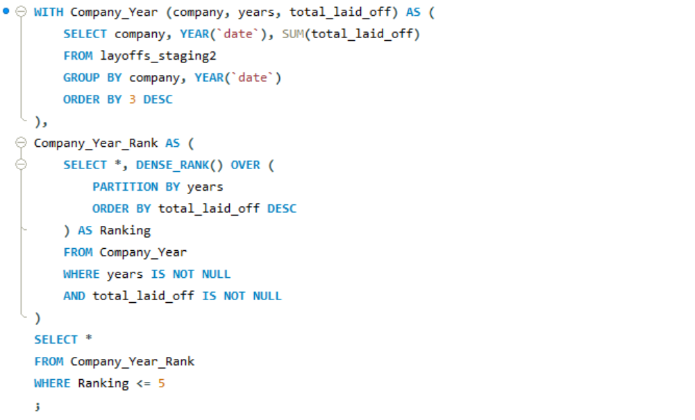

# 📉 Global Tech Layoffs – SQL Data Cleaning & Exploration


---

## 📌 Project Overview

This SQL project analyses a global dataset of tech layoffs, focusing on patterns across company size, funding, geography, and time. Using MySQL, the project involved full data cleaning and exploration to surface key trends in layoffs across the industry.

---

## 🎯 Business Objective

Executives and market analysts are increasingly focused on understanding:
- Which companies and countries were hit hardest?
- How do layoffs correlate with funding or startup stage?
- Are layoff trends getting better or worse over time?
- Which regions, sectors, or time periods require strategic attention?

---

## 🧹 Data Cleaning Process

Performed in `World Layoffs - Data Cleaning.sql`, including:
- ✅ Deduplication using `ROW_NUMBER() OVER (...)` with full record partitioning
- ✅ Standardization: trimmed whitespace, unified country names, normalized industry labels
- ✅ Date conversion and datatype updates
- ✅ Null handling: used self-joins to backfill industry data based on company/location
- ✅ Removed blank or empty rows (e.g. rows with no layoff data)

Staging tables were used throughout to preserve original data and enable rollback if needed.

---

## 🔍 Exploratory Analysis Highlights

Key queries in `World Layoffs - Exploratory Data Analysis.sql` included:

- **Total layoffs by company, year, and country**
- **Top 5 companies by layoffs each year**
- **Rolling monthly and yearly layoff trends using window functions**
- **Stage-based and industry-based analysis of impact severity**
- **Identifying locations most affected by layoffs per year**

These results would support interactive dashboards or trend reports for decision-makers.

---

## 🛠 Tools & Skills Demonstrated

- **SQL (MySQL)**: joins, CTEs, window functions, `ROW_NUMBER()`, `DENSE_RANK()`, date conversion
- **Data Cleaning**: deduplication, field standardization, NULL handling, type casting
- **Exploratory Analysis**: grouping, aggregation, time-based trends, ranking
- **Data Storytelling**: converting raw data into questions executives care about

---

## 📂 Files Included

| File | Description |
|------|-------------|
| `world_layoffs_data_cleaning.sql` | Cleans raw layoff data, removes duplicates, fixes formatting, prepares staging table |
| `world_layoffs_exploratory_data_analysis.sql` | Analyses layoff patterns by company, country, year, and other segments |

---

## 💡 Query to Identify Most Impacted Locations Each Year

```sql
WITH Location_Year (country, location, years, total_laid_off) AS (
	SELECT country,
    location,
    YEAR(date),
    SUM(total_laid_off)
	FROM layoffs_staging2
	GROUP BY country, location, YEAR(date)
	ORDER BY 3 ASC
),
Location_Year_Rank AS (
	SELECT *, DENSE_RANK() OVER (
		PARTITION BY years
		ORDER BY total_laid_off DESC
	) AS Ranking
	FROM Location_Year
	WHERE years IS NOT NULL
	AND total_laid_off IS NOT NULL
)
SELECT *
FROM Location_Year_Rank
WHERE Ranking <= 10
;
```

---

> 📸 Example Query: Top 5 Companies by Layoffs (by Year)  


---

## 📬 Contact

Feel free to reach out with any questions or feedback:

📧 mitchellrogers.uk@gmail.com
